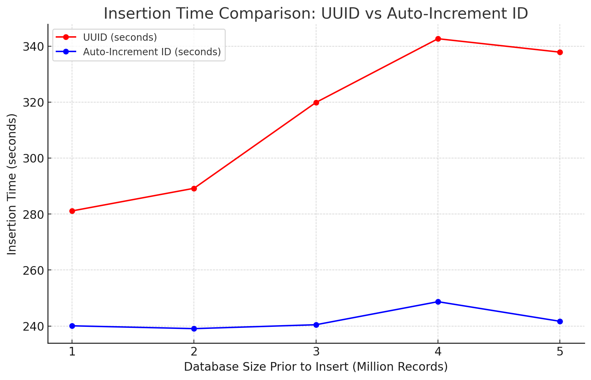
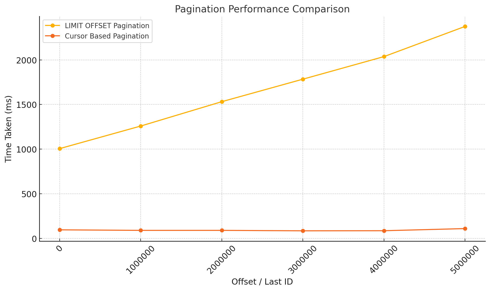

# Ditrubuted ID Generation, Benchmarking UUID vs Auto-Increment ID, Pagination Techniques

**Table of Contents**


- [Ditrubuted ID Generation, Benchmarking UUID vs Auto-Increment ID, Pagination Techniques](#ditrubuted-id-generation-benchmarking-uuid-vs-auto-increment-id-pagination-techniques)
  - [Distributed ID Generation](#distributed-id-generation)
    - [Introduction](#introduction)
    - [Different Approaches to Generating Unique Identifiers](#different-approaches-to-generating-unique-identifiers)
    - [Approaches](#approaches)
      - [1. Simple ID Generation (Epoch MS + Machine ID + Static Counter)](#1-simple-id-generation-epoch-ms--machine-id--static-counter)
      - [2. Central ID Generation Service: Amazon's Way](#2-central-id-generation-service-amazons-way)
      - [3. Fliker's Odd Even ID Generation](#3-flikers-odd-even-id-generation)
      - [4. Twitter's Snowflake](#4-twitters-snowflake)
      - [6. Snowflake At Instagram](#6-snowflake-at-instagram)
  - [Comparative Analysis of UUID and Auto-Increment ID Insertion Performance](#comparative-analysis-of-uuid-and-auto-increment-id-insertion-performance)
    - [Performance Metrics](#performance-metrics)
  - [Report: MySQL LIMIT OFFSET vs Cursor-Based Pagination](#report-mysql-limit-offset-vs-cursor-based-pagination)
    - [Overview](#overview)
    - [Implementation Details](#implementation-details)
      - [Environment:](#environment)
    - [Queries Used](#queries-used)
      - [LIMIT OFFSET Pagination Query:](#limit-offset-pagination-query)
      - [Cursor-Based Pagination Query:](#cursor-based-pagination-query)
    - [Results](#results)
    - [Raw Execution Times (in milliseconds):](#raw-execution-times-in-milliseconds)
    - [Observations](#observations)
    - [Key Findings](#key-findings)
    - [Performance](#performance)
    - [Scalability](#scalability)
    - [Index Dependency](#index-dependency)
    - [Recommendations](#recommendations)
    - [Conclusion](#conclusion)
    - [Code Used](#code-used)
  - [MySQL ON DUPLICATE KEY UPDATE vs REPLACE INTO Performance Analysis](#mysql-on-duplicate-key-update-vs-replace-into-performance-analysis)
    - [Abstract](#abstract)
    - [Experimental Setup](#experimental-setup)
      - [Environment:](#environment-1)
      - [Schema:](#schema)
    - [Results](#results-1)
      - [Performance Metrics:](#performance-metrics-1)
    - [Observation](#observation)
    - [Conclusion](#conclusion-1)
    - [Recommendations](#recommendations-1)


## Distributed ID Generation

### Introduction
This document explores different approaches to generating unique identifiers in a distributed system. The goal is to provide a comprehensive overview of the different strategies and their trade-offs.

### Different Approaches to Generating Unique Identifiers

### Approaches

#### 1. Simple ID Generation (Epoch MS + Machine ID + Static Counter)
- **Description**: This approach generates IDs by combining the current timestamp in milliseconds, a unique machine ID, and a static counter. The machine ID can be derived from the network address or some other unique identifier.
- Save the static counter with a frequency. e.g. After every 1000 IDs, save the counter to the local disk.
- Sequential Benchmark
No of IDs | Counter Store Frequency | Duration (ms)
--- | --- | ---
1 Milllion | 100 | 681
1 Milllion | 500 | 357
1 Milllion | 1000 | 315
1 Milllion | 10000 | 275
10 Milllion | 100 | 6899
10 Milllion | 1000 | 3222
10 Milllion | 10000 | 2880

#### 2. Central ID Generation Service: Amazon's Way

- **Description**: Using microservice with sql database to generate unique IDs.

- DB Schema
  -  ID | Service Name | Counter
  -  1  |  user-service | 1000
  -  2  |  order-service | 500
- We generate unique IDs in batches and increment the counter by the batch size in the database for each service.

#### 3. Fliker's Odd Even ID Generation
- Genrates unique IDs by using MySQL's auti-increment id column.
- Use two servers, 1st Server generates odd IDs and 2nd Server generates even IDs.

#### 4. Twitter's Snowflake
- **Description**: Snowflake is a distributed ID generation service that a 64 bit integer composed of:
  - 41 bits for timestamp in milliseconds
  - 10 bits for machine ID
  - 12 bits for sequence number
- Snowflake is designed to be highly scalable and can generate up to 4096 unique IDs per millisecond per machine.
- Epoch Time i.e. 1st Jan 2011 is used as a reference time. So, the timestamp is the number of milliseconds since this reference time.
- current timestamp - reference timestamp = 64 bit timestamp
#### 6. Snowflake At Instagram
- **Description**: Instagram uses a modified version of Snowflake that includes a 41-bit timestamp, 13-bit shard ID, and 10-bit sequence number.
- The timestamp is based on the number of milliseconds since the Instagram epoch (1st Jan 2011).
  - now_ms => current time in milliseconds - Instagram epoch time
  - id = now_ms << 23
  - id = id | (shard_id << 10)
  - id = id | sequence_number
- The shard ID is used to identify the DB shard, and the sequence number generated on each shard is used to ensure uniqueness.


## Comparative Analysis of UUID and Auto-Increment ID Insertion Performance

**Abstract**: This study presents a comprehensive analysis of the insertion performance of UUIDs and auto-increment IDs within a MySQL database. The experimental methodology involved inserting 1 million records into a table using either a UUID-based or an auto-increment-based primary key. The test utilized 50 pooled MySQL connections to facilitate the insertion of records, yielding insights into the computational efficiency of each approach.

**Experimental Setup**: The performance evaluation was conducted on a MacBook Pro 13-inch (2020) with an M1 chip and 16GB of RAM. MySQL was hosted within a Docker container to ensure an isolated and controlled testing environment, mitigating external influences on performance.

**Rationale**: Empirical results indicate that auto-increment IDs consistently outperform UUIDs in terms of insertion speed. This performance gap is attributed to fundamental differences in the structure and operational characteristics of the two identifiers. UUIDs are 128-bit values that are neither sequential nor monotonically increasing, necessitating more complex and resource-intensive indexing operations. Conversely, auto-increment IDs follow a sequential, monotonically increasing pattern, enabling more efficient index maintenance and insertion. Indexes utilize B+ trees, and since auto-increment IDs increase sequentially, updating the B+ tree is computationally less expensive compared to the random nature of UUID insertion.

### Performance Metrics

| **Database Size Prior to Insert (Million Records)** | **1**   | **2**   | **3**   | **4**   | **5**   |
|-----------------------------------------------------|---------|---------|---------|---------|---------|
| **Insertion Time for UUID (seconds)**               | 281.123 | 289.204 | 319.873 | 342.635 | 337.834 |
| **Insertion Time for Auto-Increment ID (seconds)**  | 240.078 | 239.069 | 240.463 | 248.697 | 241.689 |

**Analysis and Insights**: The results underscore the computational overhead of maintaining UUID indices as the database size scales. This increase in cost is due to the non-sequential nature of UUIDs, which forces index reorganization and leads to greater insertion times. By contrast, auto-increment IDs exhibit stable and consistent performance, attributed to the system’s ability to maintain index locality and minimize reorganization overhead. These findings offer valuable guidance for database architects and system designers in selecting an optimal primary key strategy for large-scale database systems.





## Report: MySQL LIMIT OFFSET vs Cursor-Based Pagination

### Overview
This report compares the performance of two pagination techniques in MySQL: **LIMIT OFFSET Pagination** and **Cursor-Based Pagination**, using a dataset of 6,000,000 rows. The test utilizes an auto-increment or monotonically increasing ID for efficient retrieval in Cursor-Based Pagination.

---

### Implementation Details

#### Environment:
- **Database:** MySQL Docker Container in M1 MacBook Pro 13-inch (2020) with 16GB RAM
- **Table:** `user2`
- **Number of Rows:** 6,000,000
- **Batch Size for LIMIT OFFSET Pagination:** 1,000,000
- **Batch Size for Cursor-Based Pagination:** 100

### Queries Used

#### LIMIT OFFSET Pagination Query:
```sql
SELECT * FROM user2 LIMIT <LIMIT> OFFSET <OFFSET>;
```
In this method, MySQL fetches all records up to the specified offset before applying the LIMIT.

#### Cursor-Based Pagination Query:
```sql
SELECT * FROM user2 WHERE id > <LAST_ID> LIMIT <LIMIT>;
```
This method uses the last ID from the previous batch to fetch the next set of records.

---

### Results

### Raw Execution Times (in milliseconds):

| Offset (or Last ID) | LIMIT OFFSET Time (ms) | Cursor-Based Time (ms) |
|---------------------|-------------------------|-------------------------|
| 0                   | 1006                   | 96                      |
| 1,000,000           | 1259                   | 90                      |
| 2,000,000           | 1532                   | 90                      |
| 3,000,000           | 1784                   | 85                      |
| 4,000,000           | 2037                   | 86                      |
| 5,000,000           | 2375                   | 110                     |



### Observations
- **LIMIT OFFSET Pagination:**
  - Time increases linearly as the offset grows.
  - Performance degrades significantly for larger offsets.

- **Cursor-Based Pagination:**
  - Time remains nearly constant regardless of the offset.
  - Minimal performance impact for large datasets.

---

### Key Findings

### Performance
- Cursor-Based Pagination outperforms LIMIT OFFSET Pagination for large datasets, especially as the offset increases.

### Scalability
- LIMIT OFFSET Pagination is not scalable for datasets with millions of records due to the increasing overhead of skipping records.
- Cursor-Based Pagination maintains consistent performance, making it suitable for large datasets.

### Index Dependency
- Cursor-Based Pagination requires an index on the `id` column for optimal performance. Without indexing, performance may degrade. Also IT work well only for Full Index Query with Index Mono-Increasing Column while fetching sequential data.

---

### Recommendations

- **Use Cursor-Based Pagination** for scalable applications with large datasets.
- Ensure the `id` column or relevant fields used for cursor-based queries are indexed.
- Avoid LIMIT OFFSET Pagination for paginating large datasets unless the offset values are small or we have to fetch non-sequential data.

---

### Conclusion

The study highlights that Cursor-Based Pagination is a more efficient and scalable technique for large datasets in MySQL. While LIMIT OFFSET Pagination is simple to implement, its performance issues at higher offsets make it less suitable for production environments handling large amounts of data.

---

### Code Used
Refer to the attached script for implementation details and query execution.

---


## MySQL ON DUPLICATE KEY UPDATE vs REPLACE INTO Performance Analysis

### Abstract
This report presents a comparative analysis of two MySQL statements, `ON DUPLICATE KEY UPDATE` and `REPLACE INTO`, for handling insertions with potential conflicts. The study evaluates the performance of these statements in a high-concurrency environment with a focus on efficiency and scalability.

### Experimental Setup

#### Environment:
- **Database:** MySQL Docker Container on MacBook Pro M1 (16GB RAM)
- **Table:** `user2`
- **Number of Records:** 6,000,000
- **Concurrency Level:** 50 connections
#### Schema:
 - id (Primary Key) - Auto-Increment
 - name - VARCHAR(255)
 - username - VARCHAR(255)
 - email - VARCHAR(255)
 - phone - VARCHAR(255)
 - website - VARCHAR(255)
 - address - VARCHAR(255)

### Results

#### Performance Metrics:
**Updated phono number of 10000 random records**

| **Statement**            | **Execution Time (ms)** |
|--------------------------|-------------------------|
| ON DUPLICATE KEY UPDATE  | 3291                 |
| REPLACE INTO             | 26709                   |


### Observation

The performance metrics clearly highlight significant differences between the two statements, particularly in terms of execution time:

1. **ON DUPLICATE KEY UPDATE**:
   - This statement performed the update operation in **3291 ms** for 10,000 random records.
   - It only updates the rows where a conflict occurs, minimizing unnecessary operations.
   - As a result, it is **more efficient** in terms of execution time, especially in high-concurrency environments, as it avoids unnecessary deletions and insertions.

2. **REPLACE INTO**:
   - This statement took **26709 ms** for the same operation.
   - It deletes the conflicting row and inserts a new one, which involves more overhead due to:
     - Additional disk I/O for deletion and insertion.
     - Cascade effects if there are foreign key constraints, as these could trigger additional operations.
   - The performance gap is substantial, with REPLACE INTO being nearly 8 or more times slower than ON DUPLICATE KEY UPDATE in this scenario.

### Conclusion

The experimental results suggest that **ON DUPLICATE KEY UPDATE** is a far more efficient and scalable option for handling insertions with potential conflicts in a high-concurrency environment. It minimizes the impact on system performance by avoiding unnecessary operations and is particularly well-suited for scenarios where only a subset of records is expected to conflict.

In contrast, **REPLACE INTO** should be used cautiously and only when the application logic explicitly requires a complete replacement of conflicting records. The significant overhead associated with deletion and reinsertion makes it less optimal for high-volume or high-concurrency workloads.

### Recommendations

- For most use cases involving updates to existing records, **ON DUPLICATE KEY UPDATE** is recommended due to its efficiency and lower resource utilization.
- Reserve **REPLACE INTO** for scenarios where a full replacement of conflicting records is unavoidable and its additional overhead is acceptable.
- When dealing with high-concurrency environments, consider optimizing indexes and ensuring minimal locking to further enhance performance.