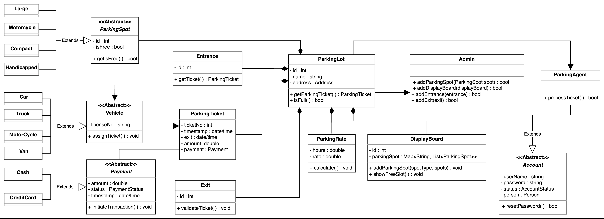

# Design a Parking Lot

## Table of Contents
- [Design a Parking Lot](#design-a-parking-lot)
  - [Table of Contents](#table-of-contents)
  - [Parking Lot Design](#parking-lot-design)
  - [Requirements](#requirements)
  - [Use Case Diagram for the Parking Lot](#use-case-diagram-for-the-parking-lot)
    - [Actors](#actors)
      - [Primary Actors](#primary-actors)
      - [Secondary actors](#secondary-actors)
    - [Use Cases](#use-cases)
      - [Admin](#admin)
      - [Customer](#customer)
      - [Parking agent](#parking-agent)
      - [System](#system)
  - [Class Diagram](#class-diagram)

## Parking Lot Design

A parking lot is a designated area for parking vehicles and is a feature found in almost all popular venues such as shopping malls, sports stadiums, offices, etc. In a parking lot, there are a fixed number of parking spots available for different types of vehicles. Each of these spots is charged according to the time the vehicle has been parked in the parking lot. The parking time is tracked with a parking ticket issued to the vehicle at the entrance of the parking lot. Once the vehicle is ready to exit, it can either pay at the automated exit panel or to the parking agent at the exit using a card or cash payment method.

## Requirements

Let’s define the requirements for the parking lot problem:
R1: The parking lot should have the capacity to park 40,000 vehicles.
R2: The four different types of parking spots are handicapped, compact, large, and motorcycle.
R3: The parking lot should have multiple entrance and exit points.
R4: Four types of vehicles should be allowed to park in the parking lot, which are as follows: Car, Truck, Van, Motorcycle
R5: The parking lot should have a display board that shows free parking spots for each parking spot type.
R6: The system should not allow more vehicles in the parking lot if the maximum capacity (40,000) is reached.
R7: If the parking lot is completely occupied, the system should show a message on the entrance and on the parking lot display board.
R8: Customers should be able to collect a parking ticket from the entrance and pay at the exit.
R9: The customer can pay for the ticket either with an automated exit panel or pay the parking agent at the exit.
R10: The payment should be calculated at an hourly rate.
R11: Payment can be made using either a credit/debit card or cash.
## Use Case Diagram for the Parking Lot
- Out System is parking lot
### Actors
#### Primary Actors
- Customer
- Parking Agent
#### Secondary actors
- Admin
- System

### Use Cases
#### Admin
- Add spot: To add a parking spot
- Add agent: To add a new agent
- Add/modify rate: To add/modify hourly rate
- Add entry/exit panel: To add and update exit/entry panel at each entry/exit
- Update account: To update account details and payment information
- Login/Logout: To login/logout to/from agent or admin account
- View account: To view account details like payment status or unpaid amount
#### Customer
- Take ticket: To take a ticket at the entrance, that contains information regarding the vehicle and its entrance time
- Scan ticket: To scan the ticket at the exit and get the parking fee
- Pay ticket: To pay the parking fee at the exit panel via cash or a credit card
- Cash: To pay the parking fee via cash
- Credit card: To pay the parking fee via credit card
- Park vehicle: To park the vehicle at the assigned destination
#### Parking agent
- Update account: To update account details and payment information
- Login/Logout: To log in/log out to/from the agent or admin account
- View account: To view account details like payment status or unpaid amount
- Take ticket: To take a ticket at the entrance, that contains information regarding the vehicle and its entrance time
- Scan ticket: To scan the ticket at the exit and get the parking fee
- Pay ticket: To pay the parking fee at the exit panel via cash or a credit card
- Cash: To pay the parking fee via cash
- Credit card: To pay the parking fee via credit card
- Park vehicle: To park the vehicle at the assigned destination
#### System
- Assigning parking spots to vehicles: To check the vehicle type and associate a free spot according to it
- Remove spot: To remove a parking spot if it is not available for parking
- Show full: To display the status of the parking lot as full
- Show available: To show the details of available parking spots

## Class Diagram

