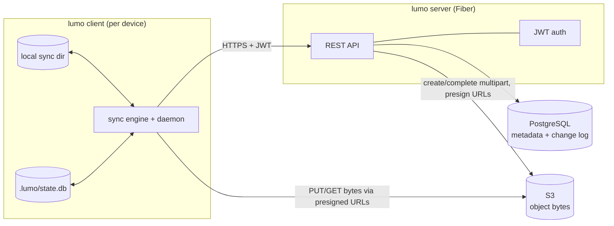
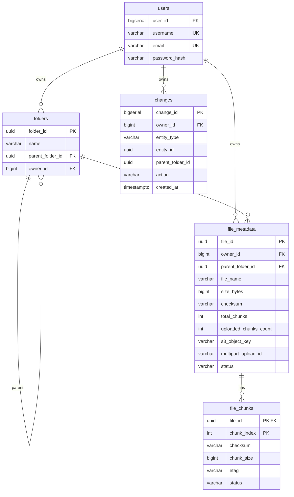
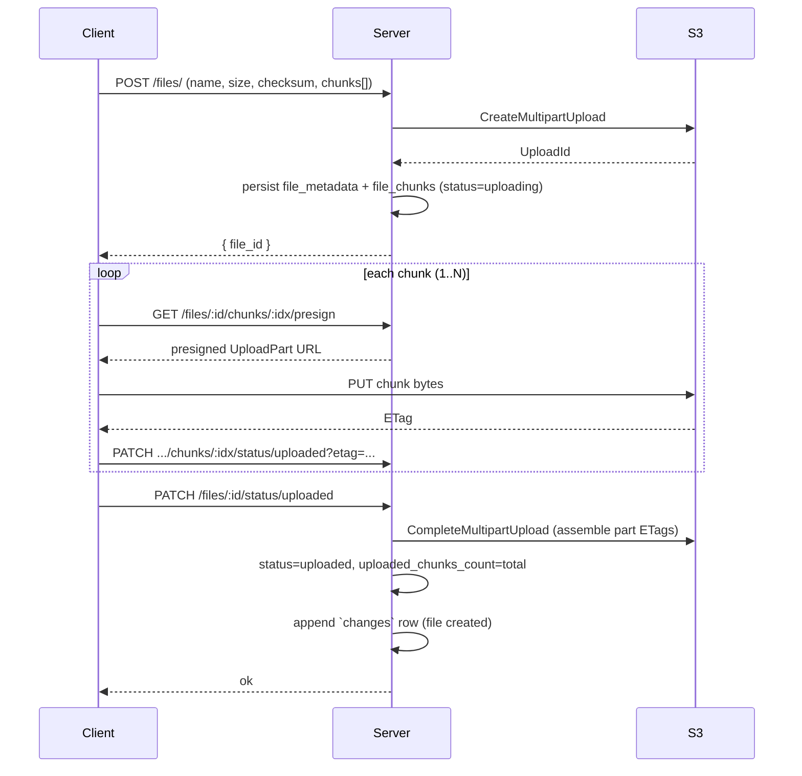
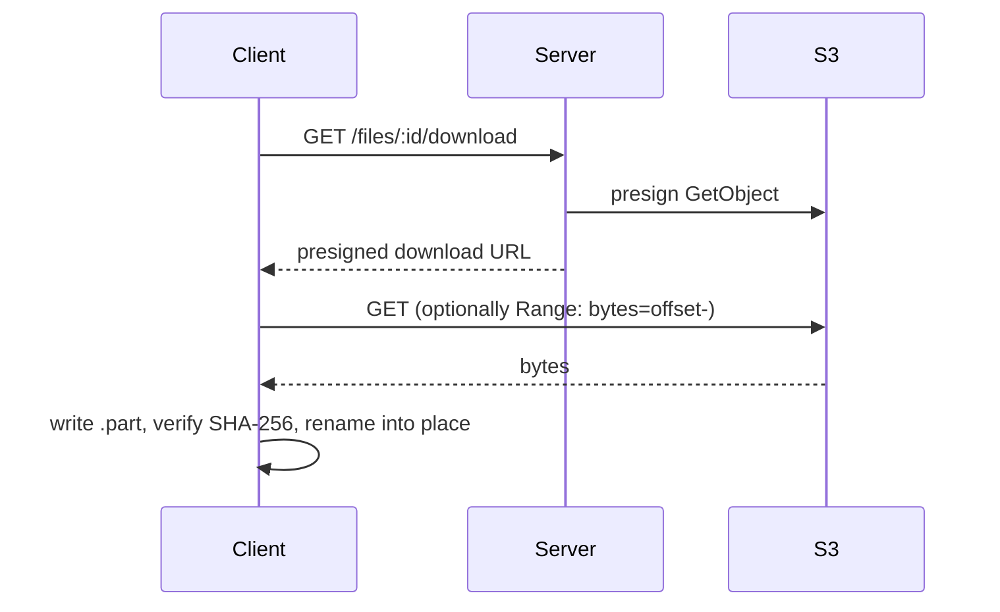
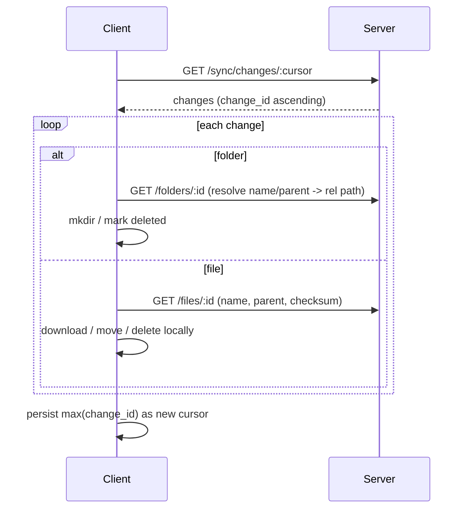
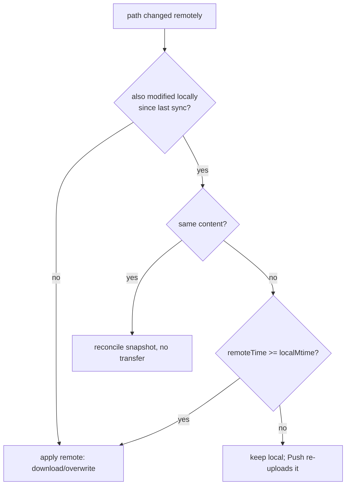

# Lumo Drive — Architecture & Design

This document describes how Lumo Drive is designed: its components, data model,
transfer and sync flows, conflict policy, and the trade-offs behind them.

- Audience: contributors and reviewers.
- Companion doc: [README.md](README.md) (setup, usage, commands).

---

## 1. System overview

Lumo Drive is a single-tenant-per-user "personal drive". A user's files and
folders live as **metadata in PostgreSQL** and **object bytes in S3**. The
**server** is the system of record and the only component that talks to S3
control APIs and the database. **Clients** never hold DB or S3 credentials —
they upload/download bytes through short-lived **presigned URLs** issued by the
server, and learn about remote changes through a **monotonic change feed**.

**Key principle — split control vs data plane.** Metadata operations and S3
*control* operations (create/complete multipart, presign) go through the server;
bulk *data* (chunk bytes) flows client↔S3 directly. This keeps the server
stateless and cheap (a small `BODY_LIMIT_MB` suffices) and lets transfers scale
with S3.

---

## 2. Components

### 2.1 Server (`server/`)

- **Framework:** Go + [Fiber v2](https://gofiber.io). Routes grouped under
  `/api/v1` (`auth`, `folders`, `files`, `sync`) in `main.go`.
- **Auth:** `auth.go` issues HS256 JWTs (7-day TTL) with `bcrypt` password
  hashing. `middleware.go` validates the bearer token and injects `user_id`.
- **Persistence:** PostgreSQL via `pgx/v4` (`db.go`); schema in `init.sql`
  applied on boot.
- **Object storage:** `aws-sdk-go-v2` S3 client (`files.go`); multipart upload +
  presigned `UploadPart` / `GetObject` URLs.
- **Change feed:** `sync.go` appends a row to `changes` for every mutation and
  serves entries after a cursor.

Server is **stateless** between requests (all state in PG/S3), so it scales
horizontally behind a load balancer.

### 2.2 Client (`client/`)

- **CLI / app:** [cobra](https://github.com/spf13/cobra). Running with no
  subcommand launches the interactive app (login/register → daemon).
- **Local state:** embedded SQLite (`modernc.org/sqlite`, pure-Go) at
  `<sync_dir>/.lumo/state.db`.
- **Transfer:** `transfer/` does 5 MiB chunking + SHA-256, presigned PUT/GET.
- **Sync engine:** `sync/` reconciles local↔remote; `daemon.go` adds a
  [fsnotify](https://github.com/fsnotify/fsnotify) watch + a poll ticker.
- **Config:** `<os-config-dir>/<CONFIG_DIR_NAME>/config.json` (default dir name
  `lumo`). Stores a generated **client id** (UUID, identifies the install),
  server URL, token, sync dir, and user. The dir name is overridable with
  `CONFIG_DIR_NAME` (full path with `LUMO_CONFIG`); pointing each instance at a
  distinct `CONFIG_DIR_NAME` (and `SESSION` for `run.sh`) lets several
  independent clients run on one machine.

---

## 3. Data model

Notes:
- **Soft deletes**: deleting a file/folder reparents it into a reserved per-user
  `Trash` folder (auto-created on first delete) and sets file `status=deleted`.
- **`s3_object_key`** = `<owner_id>/<file_id>`, namespacing objects per user.
- **`changes`** is an append-only log; `change_id` is the global sync cursor.

---

## 4. Upload flow (chunked multipart)

Chunk size is a fixed **5 MiB**. `chunk_index` is **1-based** because it maps
directly to the S3 multipart `PartNumber` (which starts at 1). The client must
split on the same boundary the server uses to derive `total_chunks`.

- **Resumable**: `POST /files/:id/resume` returns chunk indices not yet
  `uploaded`; the client re-uploads only those, then re-marks the file uploaded.
- **Integrity**: per-chunk and whole-file SHA-256 are recorded; the client
  verifies the whole-file checksum after download.

## 5. Download flow

Downloads resume from a sibling `.part` file using an HTTP `Range` request.

---

## 6. Sync & change tracking

The client maintains a **filesystem mapping** in SQLite: each local `rel_path`
maps to a remote `file_id`/`folder_id` plus a *last-synced snapshot*
(size, mtime, checksum). The treats `rel_path` as the logical identity — a
content change re-uploads as a new `file_id` for the same path.

**Pull** replays the change feed:

The remote tree is reconstructed entirely from the change feed (replay from
cursor `0` on a fresh client) plus `GET /files/:id` and `GET /folders/:id`
lookups — there is no "list root" call.

**Push** walks the local tree: fast change detection by `(size, mtime)` with a
SHA-256 fallback; new/changed files are uploaded, local deletions become remote
deletes, and new directories become remote folders. **Hidden entries** — any
path with a dot-prefixed segment (`.DS_Store`, `.git`, the client's own
`.lumo/`) — are skipped by both the walk and the fsnotify watcher, so they are
never uploaded, watched, or treated as deletions.

**`sync` = Pull then Push** in one pass (remote first, since remote is the source
of truth). The **daemon** runs `sync` on a debounced filesystem event and on a
poll ticker, serialized by a mutex.

### 6.1 Conflict resolution

A path edited on **both** sides since the last sync is a conflict. Policy:

- **Remote is the source of truth**; **last edit wins**: compare the local file
  mtime against the remote change timestamp.
- **Tie → remote wins** (preferring the authoritative copy).
- Identical content on both sides is *not* a conflict (snapshot is reconciled).
- Remote delete vs newer local edit → local is kept and re-uploaded.

The **snapshot is the coordination point**: after a side "wins", its content is
recorded as the synced state, so the next pass is a no-op (idempotent sync).

### 6.2 Offline access

The local directory is always usable. The daemon probes `GET /health`; while the
server is unreachable it logs and keeps running, so local edits accumulate and
are flushed on the next successful sync once connectivity returns.

---

## 7. Security model

- All mutating/reading endpoints require a valid HS256 JWT; ownership is enforced
  on every query (`owner_id = $user`).
- Clients never receive DB/S3 credentials — only short-lived presigned URLs.
- Passwords are bcrypt-hashed; login responses never include the hash.
- The client config file (holding the token) is written `0600`.
- **Production hardening needed:** set a strong `JWT_SECRET` (the dev default is
  insecure), serve over TLS, and scope S3/IAM to the bucket.

---

## 8. Notable decisions & trade-offs

- **Presigned direct-to-S3 transfers** keep the server stateless and the request
  body limit tiny; the cost is a chattier handshake (presign per chunk).
- **Path-based identity on the client** matches user intuition (a file *is* its
  location) and sidesteps the lack of server-side file versioning, at the cost
  of treating a content edit as a new object.
- **Append-only change log** gives a simple, ordered, resumable sync cursor
  without server push/websockets; the trade-off is client polling latency.
- **Fixed 5 MiB chunks** keep client and server chunk math in lockstep and fit
  S3's multipart minimum; very large files therefore have many parts.

## 9. Known limitations / future work

- No file sharing or multi-user permissions (single-owner drives).
- Re-uploading edited content creates a new `file_id` (no version history);
  the old object is not garbage-collected.
- Sync uses polling, not server push; latency is bounded by the poll interval.
- Folder move does not guard against cycles; Trash is not auto-emptied.
- No server-side rate limiting or pagination on the change feed yet.
