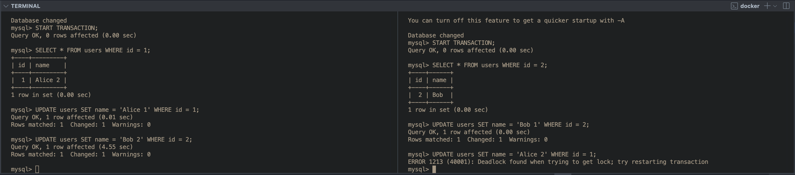

# SQL Locking

## Introduction

In this experiment, we will explore the concept of SQL locking mechanisms and their impact on database transactions. SQL locking is a crucial aspect of database management systems that ensures data consistency and integrity during concurrent access. By understanding how different locking strategies work, we can design more efficient and reliable database applications.

## Tools
- MySQL

## Experiment

1) Deadlock

In this experiment, we will simulate a deadlock scenario using MySQL. A deadlock occurs when two or more transactions are waiting for each other to release locks, resulting in a situation where none of the transactions can proceed. We will demonstrate how deadlocks can happen and discuss strategies to detect and resolve them.

## Experiment 1: Deadlock

```bash
docker run -d -it --name mysql -e MYSQL_ROOT_PASSWORD=root -p 3306:3306 mysql:latest
docker exec -it mysql mysql -uroot -proot
```

- Open two terminals
  
```sql
# Create DB
CREATE DATABASE testdb;
USE testdb;
# Create table
CREATE TABLE users (id INT PRIMARY KEY AUTO_INCREMENT, name VARCHAR(255));
```

### Case 1: No Wait

- Terminal 1

```sql
# Insert data
INSERT INTO users (name) VALUES ('Alice');
SELECT * FROM users;
```

- Terminal 2

```sql
# Insert data
INSERT INTO users (name) VALUES ('Bob');
SELECT * FROM users;
```

### Case 2: Wait for T1 to commit

- Terminal 1

```sql
START TRANSACTION;
SELECT * FROM users WHERE id = 1 FOR UPDATE;
COMMIT;
```

- Terminal 2

```sql
START TRANSACTION;
SELECT * FROM users WHERE id = 1;
COMMIT;
```


### Case 3: Deadlock

- Terminal 1

```sql
START TRANSACTION;
SELECT * FROM users WHERE id = 1;
UPDATE users SET name = 'Alice 1' WHERE id = 1;
UPDATE users SET name = 'Bob 2' WHERE id = 2;
COMMIT;
```

- Terminal 2

```sql
START TRANSACTION;
SELECT * FROM users WHERE id = 2;
UPDATE users SET name = 'Bob 1' WHERE id = 2;
UPDATE users SET name = 'Alice 2' WHERE id = 1;
COMMIT;
```



